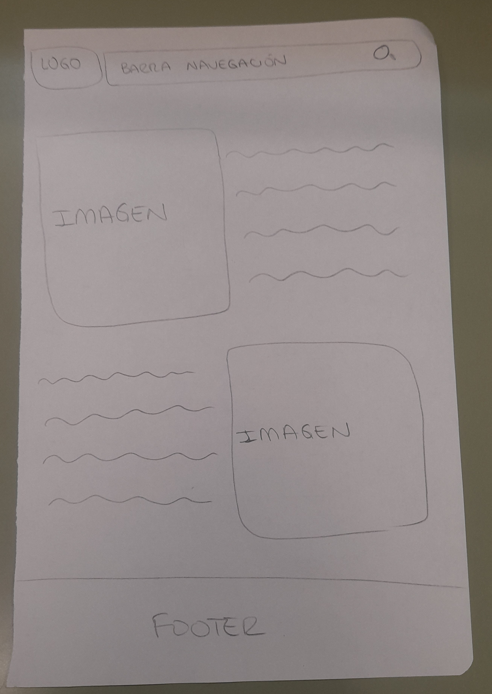
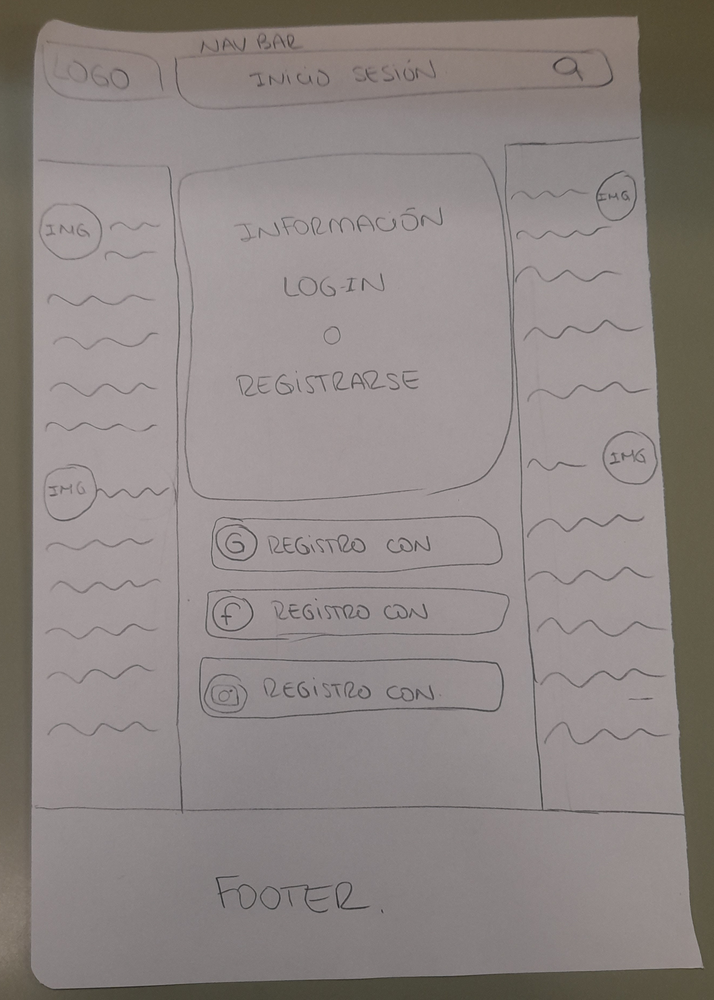
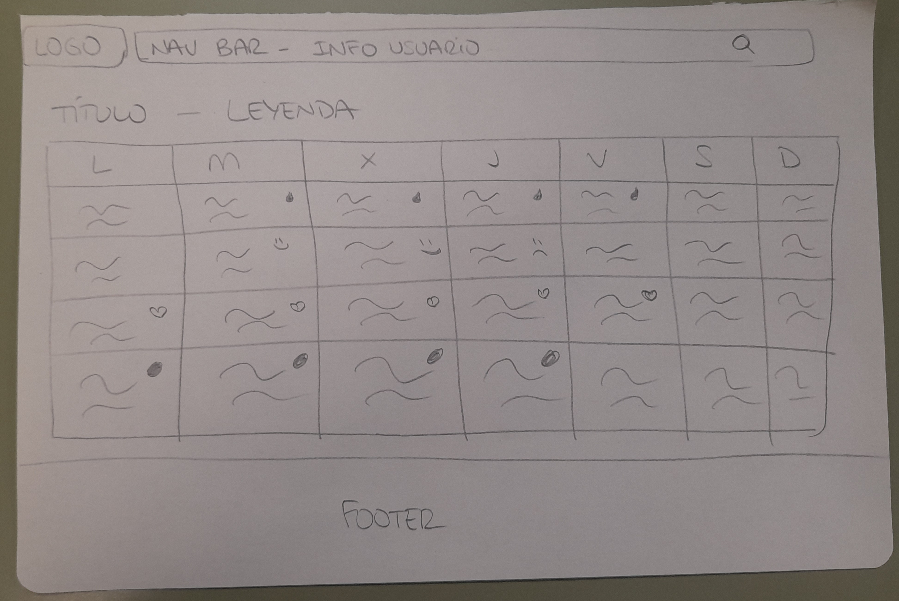

## Actividad 2: Bocetos web.

### Crear un boceto de un sitio web libre (a elección libre del alumnado), en papel o en una herramienta ad hoc. 
### El sitio ha de contener al menos 3 páginas relacionadas, esto es, que se pueda navegar de unas a otras.

**Página de inicio/sobre nosotros**

 

**Página de inicio de sesión/registro**

**Calendario**

