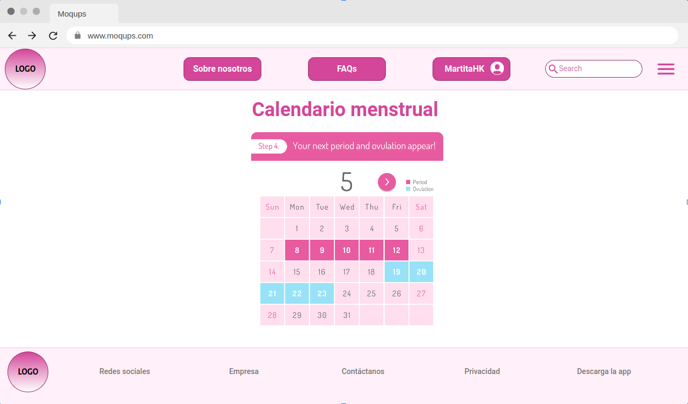

## Actividad 3: Maquetas web.

### Crear las maquetas (mockups) de las páginas del sitio web elegido en la actividad anterior (Actividad 2). Usar una herramienta tal y como Balsamiq (tb puede ser cualquier otra herramienta).

**Página principal**

**Página de inicio de sesión**

**Calendario (una vez iniciada la sesión)**

